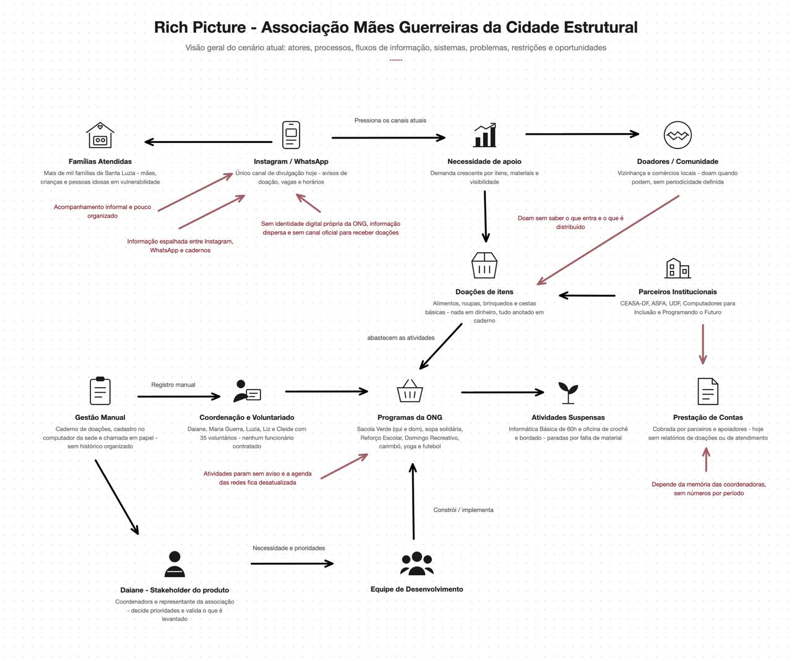

# 1. Cenário Atual do Cliente e do Negócio

Esta seção apresenta o cliente do projeto (a Associação Mães Guerreiras da Cidade Estrutural), o
contexto em que ela atua, seu cenário atual de trabalho manual, a oportunidade identificada, os
desafios do projeto, o mapa de stakeholders e a segmentação dos usuários da futura plataforma.

## 1.1 Identificação do Cliente/Parceiro

- **Nome:** Associação Mães Guerreiras da Cidade Estrutural (fundada em 01/10/2019, CNPJ
  48.320.842/0001-57).
- **Tipo:** Associação comunitária sem fins lucrativos, mantida integralmente por trabalho voluntário.
- **Representante:** Daiane, coordenadora da associação, responsável por definir prioridades e validar
  as entregas do projeto.
- **Outros contatos:** Makio Augusto Cândido, voluntário e principal ponte entre a equipe e a
  associação, responsável por receber e avaliar as entregas antes de levá-las à coordenação; Maria
  Guerra (presidente); e as coordenadoras Luzia, Liz e Cleide.
- **Forma de contato:** telefone e WhatsApp (61) 99617-1330, reuniões presenciais na sede (SI 02,
  quadra 2, lote 13, Santa Luzia, Cidade Estrutural/DF) e Instagram institucional
  (@maesguerreiras_df).
- **Vínculo com o projeto:** Cliente real e parte interessada principal, responsável por fornecer
  informações sobre a operação da associação, validar as decisões do projeto e avaliar as entregas ao
  longo do desenvolvimento.

## 1.2 Introdução ao Negócio e Contexto

A Associação Mães Guerreiras da Cidade Estrutural nasceu em 2019 da mobilização de mães em situação
de vulnerabilidade da comunidade de Santa Luzia, na Cidade Estrutural (DF), região marcada pela
ausência de saneamento básico, água potável e infraestrutura urbana. A associação é mantida por cerca
de 35 voluntárias e voluntários (não há funcionários contratados) e é conduzida por uma presidente,
Maria Guerra, e por um grupo de coordenadoras responsáveis pelas diferentes frentes de atuação.

A associação atua praticamente de domingo a domingo, com ações organizadas em quatro eixos:
educação e capacitação, segurança alimentar, convivência e bem-estar, e geração de renda. Na doação
de alimentos, já foram atendidas mais de mil famílias da comunidade.

### Educação e capacitação

- **Reforço Escolar:** às terças e sextas-feiras, das 8h30 às 10h30 e das 14h30 às 16h30, em Português e
  Matemática, para alunos do Ensino Fundamental e Médio.
- **Informática Básica:** curso gratuito de 60 horas com emissão de certificado, realizado no laboratório
  de informática mantido em parceria com os programas Computadores para Inclusão e Programando o
  Futuro (Ministério das Comunicações). Está temporariamente suspenso, aguardando a organização do
  segundo andar da sede.

### Segurança alimentar

- **Sacola Verde (entrega de verduras):** às quintas-feiras e aos domingos, das 14h30 às 15h30, com
  apoio da CEASA-DF. O atendimento é organizado por ordem de chegada, com entrega de senhas.
- **Doação de sopa e cozinha solidária:** às quartas-feiras, com apoio da ASFA, voltada a pessoas em
  situação de vulnerabilidade.
- **Doação de mantimentos e cestas básicas:** cestas básicas, frangos, peixes e pães, distribuídos
  ocasionalmente e avisados no grupo de WhatsApp. Como não há doadores fixos, não existe data
  definida para as distribuições.

### Convivência, cultura e bem-estar

- **Domingo Recreativo:** realizado em dois domingos por mês, reúne em média 80 crianças, com
  futebol, pintura, café da manhã e almoço. Para alcançar mais crianças, a associação faz um rodízio
  mensal entre os grupos. Sua realização depende do recebimento de doações.
- **Futebol:** aos domingos pela manhã, voltado ao desenvolvimento físico e ao trabalho em equipe. É a
  única atividade que não é divulgada nas redes sociais.
- **Carimbó:** grupo de voluntárias que ensaia uma vez por semana e se apresenta quando a associação
  é convidada e dispõe de recursos para participar.
- **Yoga e Hitbox:** Yoga às segundas-feiras e hitbox às quartas-feiras, das 9h às 10h, voltados à saúde e
  ao bem-estar das mulheres da comunidade.
- **Roda de Conversa com psicólogo:** aos sábados, das 15h às 16h, conduzida por estudantes de
  Psicologia da UDF, com foco em escuta e acolhimento das mães.
- **Oficinas com mulheres e atividades com idosos:** encontros de aprendizado, convivência e
  valorização das pessoas idosas da comunidade.

### Geração de renda

- **Crochê e bordado:** oficina voltada à autoestima e à geração de renda extra das mães. Está
  temporariamente suspensa, aguardando equipamentos ou recursos para a compra de materiais.

### Como a associação se organiza hoje

Toda a gestão é feita de forma manual. As doações recebidas são anotadas em cadernos e, por falta de
tempo e de organização, nem sempre chegam a ser registradas. O cadastro das famílias é mantido em
um computador da sede, com nome, idade, endereço e telefone, e o acompanhamento da participação
também acontece pelo grupo das mães no WhatsApp. A chamada das crianças é feita à mão, em papel.

A comunicação interna acontece por reuniões presenciais e grupos de WhatsApp, e a divulgação para a
comunidade é feita pelo Instagram (@maesguerreiras_df), pelo Facebook, por panfletos e por cartões de
divulgação. A associação conta ainda com parceiros institucionais como CEASA-DF, ASFA, UDF e os
programas federais Computadores para Inclusão e Programando o Futuro.

## 1.3 Rich Picture

O Rich Picture ilustra o cenário atual da associação: o Instagram e o WhatsApp como único canal de
divulgação, pressionados pela demanda crescente de apoio de doadores e da comunidade; as doações de
itens recebidas de parceiros institucionais e da comunidade, anotadas em caderno e sem controle do
que entra e do que é distribuído; a coordenação e o voluntariado sustentando manualmente a gestão
(caderno de doações, cadastro no computador da sede, chamada em papel) e os programas da ONG,
com atividades que param sem aviso por falta de material; e uma prestação de contas que hoje depende
apenas da memória das coordenadoras, sem números por período. Daiane, como stakeholder do
produto, e a equipe de desenvolvimento aparecem na base do diagrama, traduzindo as necessidades e
prioridades levantadas nesse cenário em requisitos para a Plataforma Mães Guerreiras.

## 1.4 Identificação da Oportunidade ou Problema

A associação tem uma operação consolidada, parceiros institucionais reconhecidos e alcance real na
comunidade, mas toda a sua gestão depende de registros manuais que se perdem. Isso gera problemas
concretos:

- As doações de itens (alimentos, roupas, brinquedos e cestas básicas) são anotadas em cadernos e,
  por falta de tempo, nem sempre são registradas: parte do que entra e do que é distribuído
  simplesmente não fica documentado;
- Não existe nenhum relatório organizado: a associação não sabe dizer com precisão quanto recebeu
  por mês, por campanha, quantas doações chegaram nem quais tipos de itens foram distribuídos;
- Sem esses números, a prestação de contas a parceiros como CEASA-DF, ASFA e UDF depende da
  memória das coordenadoras, e a associação perde argumentos concretos para conquistar novos
  apoiadores e patrocinadores;
- O cadastro das famílias existe em um computador da sede, mas não se conecta ao controle de
  presença nem ao registro das doações distribuídas;
- A chamada das crianças no Reforço Escolar, no futebol e no Domingo Recreativo é feita em papel, e
  a regra de liberar a vaga após cinco faltas sem justificativa depende de conferência manual;
- O atendimento da Sacola Verde é organizado por ordem de chegada com entrega de senhas, sem
  registro de quem foi atendido em cada distribuição;
- A comunidade não tem onde consultar o que está ativo: atividades suspensas (Informática Básica e
  Crochê e Bordado) e atividades que dependem de doação (Domingo Recreativo) se misturam às
  demais nas redes sociais;
- Informações institucionais dependem de Stories e destaques do Instagram, de panfletos e de
  cartões, e as vagas em novas turmas são divulgadas apenas nos grupos de WhatsApp, alcançando
  quem já está próximo da associação.

A oportunidade é substituir os cadernos e as folhas de chamada por ferramentas digitais simples, que
registrem em poucos cliques o que hoje se perde, e reunir em um canal próprio a informação
institucional que hoje está espalhada, transformando o trabalho já realizado em dados capazes de
sustentar a prestação de contas e a captação de novos apoios.

## 1.5 Desafios do Projeto

- A coordenação tem baixa familiaridade com ferramentas digitais além do WhatsApp e das redes
  sociais: se o registro de uma doação não for mais rápido que anotar no caderno, a ferramenta não
  será adotada;
- São cinco coordenadoras com responsabilidades diferentes, o que exige controle de acesso por
  perfil em vez de um único login compartilhado;
- O sistema tratará dados pessoais de famílias em situação de vulnerabilidade (nome, idade,
  endereço e telefone), o que exige cuidado com privacidade e conformidade com a LGPD;
- O projeto é conduzido em regime pro bono, sem orçamento, o que restringe hospedagem, domínio
  e demais serviços às alternativas gratuitas;
- A associação tem muitas frentes e um calendário semanal cheio, e a disponibilidade das voluntárias
  para validar entregas é limitada: as validações precisam ser curtas;
- O escopo levantado é ambicioso para um semestre, sendo necessário priorizar rigorosamente o que
  entra no MVP.

## 1.6 Mapa de Stakeholders

Os principais stakeholders do projeto são: Daiane, coordenadora e representante do cliente, responsável
por definir prioridades e validar as entregas; Maria Guerra, presidente da associação, responsável
institucional pela organização; as demais coordenadoras (Luzia, Liz e Cleide), que utilizarão o painel
administrativo no dia a dia e precisarão de acessos compatíveis com suas responsabilidades; as cerca de
35 voluntárias e voluntários que conduzem as atividades; as famílias beneficiárias, impactadas pelo
cadastro, pelas inscrições e pela organização do atendimento; os doadores de itens, que precisam saber
o que a associação precisa e como entregar; os parceiros institucionais (CEASA-DF, ASFA, UDF e os
programas federais Computadores para Inclusão e Programando o Futuro), destinatários da prestação de
contas; e a equipe de desenvolvimento, responsável por construir a solução, garantir sua simplicidade de
uso e a proteção dos dados.

A seguir, é apresentado um quadro resumo dos stakeholders.

| Stakeholder | Relação com a solução | Interesse principal | Influência |
| :--- | :--- | :--- | :--- |
| Daiane (coordenação) | Representante do cliente | Garantir que a solução represente a associação e apoie a captação de parcerias | Alta |
| Makio Augusto Cândido | Voluntário principal que faz a ponte de comunicação da equipe com a associação | Validar escopo, prioridades e entregas do projeto | Alta |
| Demais coordenadoras (Luzia, Liz e Cleide) | Usuárias internas do painel administrativo | Registrar doações, cadastros e presença de forma rápida, com acesso conforme sua responsabilidade | Alta |
| Voluntárias e voluntários (cerca de 35) | Usuários internos e apoiadores das atividades | Saber onde ajudar e registrar as atividades que conduzem | Média |
| Famílias beneficiárias | Impactadas pela solução | Saber o que está ativo, como participar e ser atendidas com organização | Média |
| Doadores de itens (pessoas e comércios) | Usuários externos | Doar de forma simples e ver o destino das doações | Média |
| Parceiros institucionais (CEASA-DF, ASFA, UDF, Programando o Futuro) | Apoiadores e destinatários da prestação de contas | Acompanhar o impacto do apoio concedido | Alta |
| Equipe de desenvolvimento | Responsável pela construção do produto | Entregar uma solução viável, simples de usar e de qualidade | Alta |

## 1.7 Segmentação de "Clientes" (usuários da plataforma)

- **Coordenação da associação:** as cinco coordenadoras que registram doações, cadastros e presença,
  com necessidades de acesso distintas conforme sua responsabilidade;
- **Voluntárias e voluntários:** cerca de 35 pessoas que conduzem as atividades e precisam saber onde
  e quando ajudar;
- **Famílias beneficiárias:** moradoras de Santa Luzia que participam das atividades e recebem
  doações, incluindo mães, crianças e pessoas idosas;
- **Doadores de itens:** pessoas da comunidade, comércios e apoiadores que doam alimentos, roupas,
  brinquedos e mantimentos;
- **Parceiros institucionais e potenciais patrocinadores:** organizações como CEASA-DF, ASFA e UDF,
  que apoiam a associação e precisam acompanhar o impacto do apoio concedido.
