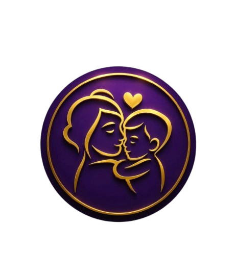

  
  

    <h1>Mães Guerreiras</h1>
    
Visão do Produto e Projeto para a Associação Mães Guerreiras da Cidade Estrutural (DF), parceira real do projeto na disciplina de Requisitos de Software.

  

## Sobre o projeto

O objetivo do produto é substituir os controles manuais da Associação Mães Guerreiras (cadernos de
doações, cadastro isolado no computador da sede e listas de chamada em papel) por uma plataforma
web simples, que registre em poucos cliques as doações de itens recebidas e distribuídas, o cadastro das
famílias e a presença nas atividades, e que transforme esses registros em relatórios de impacto capazes
de sustentar a prestação de contas aos parceiros. Saiba mais no [Objetivo Geral do Produto](02-solucao/index.md#21-objetivo-geral-do-produto).

## Estrutura da documentação

  <a href="01-cenario/" class="topic-card">
    01
    <h3>Cenário</h3>
    
Cliente, contexto do negócio, oportunidade, desafios e stakeholders.

  </a>
  <a href="02-solucao/" class="topic-card">
    02
    <h3>Solução</h3>
    
Objetivos, características de produto, tecnologias, mercado, viabilidade e benefícios.

  </a>
  <a href="03-intervencao-social/" class="topic-card">
    03
    <h3>Intervenção Social</h3>
    
Impactos sociais pretendidos e efeitos emergentes a observar.

  </a>
  <a href="04-estrategias/" class="topic-card">
    04
    <h3>Estratégias</h3>
    
Abordagem ágil, comparação de processos e justificativa do ScrumXP.

  </a>
  <a href="05-er/" class="topic-card">
    05
    <h3>Engenharia de Requisitos</h3>
    
Atividades, práticas e técnicas de ER mapeadas ao ScrumXP.

  </a>
  <a href="06-cronograma/" class="topic-card">
    06
    <h3>Cronograma</h3>
    
Sprints, entregas esperadas e validações com o cliente.

  </a>
  <a href="07-interacao/" class="topic-card">
    07
    <h3>Equipe</h3>
    
Composição da equipe, comunicação e processo de validação.

  </a>

## Identificação e Histórico de Revisão

### Identificação

| Campo | Informação |
| :--- | :--- |
| **Produto** | Mães Guerreiras |
| **Versão** | 0.3 |
| **Equipe** | Luan, Isabella, Luis, Ian, Pedro e Vitor |
| **Disciplina** | Requisitos de Software, 2026.2 |

### Histórico de Revisão

| Data | Versão | Descrição | Autor |
| :--- | :--- | :--- | :--- |
| 14/08/2026 | 0.1 | Proposta inicial de projeto Mães Guerreiras | Isabella Lacerda |
| 04/09/2026 | 0.2 | Inclusão das seções 1.6, 2.3, 2.4, 2.6, 2.7, 3, 4, 5, 6 e 7 | Isabella Lacerda |
| 04/09/2026 | 0.3 | Refatoração completa do documento a partir das respostas do questionário aplicado à associação e do material institucional recebido | Isabella Lacerda |
